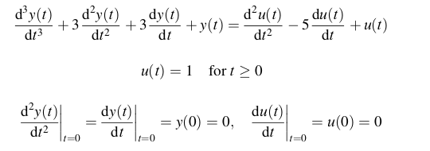
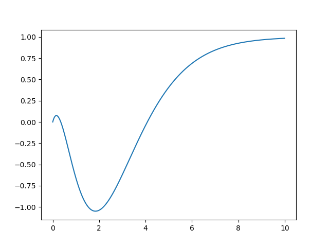

### __Dynamic System Integration and Plotting with C++__
---

This is a quick demonstration on how to solve a state representation with the
Euler method, collecting the values, and then plotting them.

I didn't found a solution that wasn't easy out there so I thought on getting
the easiest plotting and a good math-algebra library to work with.

This is based on some work I did before with simulation. There's some potential
on expanding this, which I'll do once I have more time.


Requirements:
* [Python Matplotlib](https://matplotlib-cpp.readthedocs.io/en/latest/compiling.html#requirements)

Run:
* Run ```make```
* Execture ```euler1```

<br><br>

### __Results__
---

Differential equation for the demo program.
Obtained from _Sung, Lee et al., (2009). ProcessIndentification and PID Control, Section 2.1.2_.




Plotted solution

